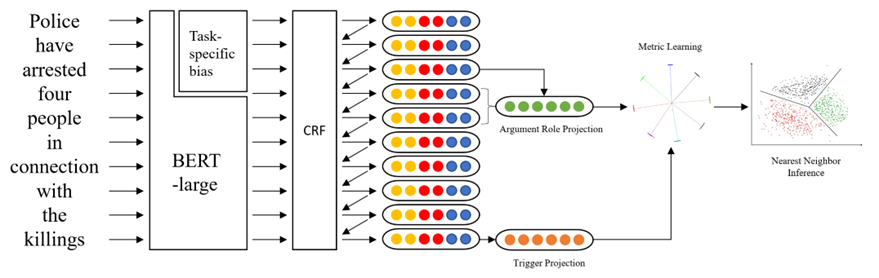

# Continual Joint Multiple Events Extraction via Adaptive Bias Mixing
A paper I am working on

Continual event extraction is of practical utility in natural language processing. In the real world, it is common to encounter novel event types or data sources, on which the model needs to quickly adapt without forgetting knowledge of old tasks. Existing work on continual event extraction either always reuses existing parameters to learn new tasks, or blindly adds new parameters for every new task, incurring significant computational cost while preventing potential share of knowledge between tasks. To get the best of both worlds, in this work, we propose continual joint event extraction with adaptive bias mixing to adapt model for incoming tasks in a parameter efficient manner. We also incorporate metric learning to construct a prototypical network for maximum parameter efficiency. Experiment results on ACE2005 dataset show that our framework retains baseline performance with significantly smaller parameter size.
#### Visualization of mixed bias composition

    

#### Data

I used ACE2005 Dataset, If you want to run your own datasets, please following their guidelines to prepare the data.

#### Environment

Requirements.txt provide some dependencies. All experiments in this paper are run on 2080 Ti with PyTorch 1.9.

(Note that the authors themselves observe that the same code might get different numbers on different devices/library versions, and the findings in the paper still hold.)

Note that the folder `mytransformers` contains the 2.0 version of adapter-transformers (aka [AdaphterHub](https://adapterhub.ml/)). We add some necessary functions to support our framework.

#### Setup
1. Create the following two directories in wherever you want. (you can name the directories arbitrarily):
    - `data directory`: Where the dataset will be load by the model.
    - `model directory`: The place for the model to dump its outputs.
2. Download the dataset using link in prior work's repo.
3. Setup `env` file.
4. Install pyrouge manually, you might find this [link](https://stackoverflow.com/questions/45894212/installing-pyrouge-gets-error-in-ubuntu) useful.
5. Setup other necessary customized configs.

#### Training and Testing
1. Follow guidelines in prior work's repo: [LAMOL](https://github.com/jojotenya/LAMOL) and [L2KD](https://github.com/voidism/L2KD).
2. We provide examples in `LAMOL.sh` and `LAMOL_myadaptor.sh`.
3. We also provide the details of different hyper parameters in `LAMOL.sh` and `LAMOL_myadaptor.sh`.

#### Tips from the authors
1. We add a lot of args in `settings.py` and `settings_myadaptor.py`. Many of them are not used in our paper, but might be used somewhere in the code (without functioning). For used args we add on the original implementation of LAMOL, we add `help` to help you know the role of those args.
2. Our code is based on two prior repos: (i) LAMOL and its following work ([LAMOL](https://github.com/jojotenya/LAMOL) and [L2KD](https://github.com/voidism/L2KD)) (ii) adapter-transformer 2.0. Here are some suggestions to understand our code:
   1. For training and testing logic, the pattern of LAMOL, try to first read the code from LAMOL.
   2. For how to add and use adapter module, try to first read the source code/framework of adapterhub to have basic understanding of how they implement adding adapters and set training adapters.

#### Acknowledgement

- We adapt the code of [LAMOL](https://github.com/jojotenya/LAMOL) and [L2KD](https://github.com/voidism/L2KD). Huge thanks to our open-source prior work!!!
- We adapt the code of [AdapterHub](https://adapterhub.ml/) (Version 2.0). Huge thanks!!!
  
(Copy from their acknowledgement as follow:)

- We use the language model offered by [transformers](https://github.com/huggingface/transformers), a state-of-the-art natural language processing models library by Thomas Wolf et al.
- The implementation of MAS follows [MAS-Memory-Aware-Synapses](https://github.com/rahafaljundi/MAS-Memory-Aware-Synapses), the Memory Aware Synapses method implementation code by Aljundi R. et al.
- The implementation of GEM follows [GradientEpisodicMemory](https://github.com/facebookresearch/GradientEpisodicMemory), the Gradient Episodic Memory method implementation code by Lopez-Paz, David et al.
- The implementation of fp16 (`fp16.py`, `fp16util.py`) is from [Megatron-LM](https://github.com/NVIDIA/Megatron-LM), the ongoing research training transformer language models at scale by NVIDIA.
- Data format conversion refer to [decaNLP](https://github.com/salesforce/decaNLP), the Natural Language Decathlon: Multitask Learning as Question Answering implementation code by Bryan McCann et al.

#### Citation
Yet to be published

#### Questions

If you have any questions about our paper and code, please contact Lu Chengeng via `qq844303749@gmail.com`.
